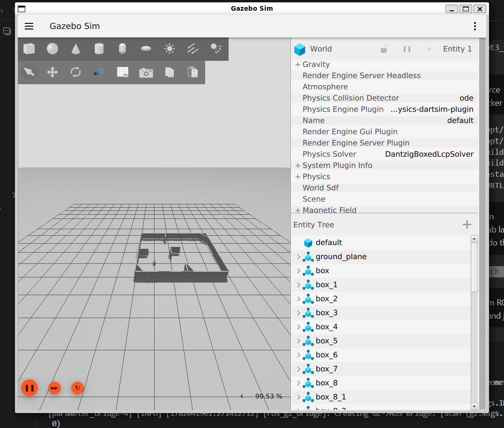

# Farming Turtle Bot

We are *Team 9*. This is a repository for keeping our code for the
CBL Autonomous Systems Twinning course.

**Authors (the active team members):**
  - Joël Rodenbach, 2324784
    - GitHub: @FunMetJoel
    - Git: FunMetJoel <machinebouwclub@gmail.com>
  - Samu Németh, 2252449
    - GitHub: @samunemeth
    - Git: Samu Nemeth <nemeth.samu.0202@gmail.com>
    - Git: Samu Németh <nemeth.samu.0202@gmail.com>
  - Ignacy Świderski, ???????
    - GitHub: @igifigi
    - Git: Ignacy Świderski <ignacyswiderski@wp.pl>
    - Git: Ignacy Świderski <44808028+Igifigi@users.noreply.github.com>
  - Can Erturk, ???????
    - GitHub: @ErturkCan
    - Git: Can Erturk <63166629+ErturkCan@users.noreply.github.com>
  - Marnix van den Bosch, 2293781
    - GitHub: @Marnix900
    - Git: marnix900 <marnixvdbosch05@gmail.com>
    - Git: marnix900 <61279855+marnix900@users.noreply.github.com>
  - Frederic Cahn von Seelen, 2305003
    - GitHub: @frederic-cvs
    - Git: frederic-cvs <entire.twice-0v@icloud.com>

**Lab Laptop Credentials:**
  - Username: `team09`
  - Password: `drinkandsmile5`

Please keep commit messages concise and all lower case. Add extra detail to the
description if needed.

For instructions on demonstrating state synchronisation consult the
[README of the `tb3_state_dt` package](./src/tb3_state_dt/README.md).


## Running the Docker Container (Simulated TurtleBot)

To run the code without having access to the lab laptop or real robot,
running inside the docker container on windows using WSL is possible.

1. Open WSL
2. Start up docker desktop, or another way to run docker
3. Setup the docker container:
   ```sh
   docker run --rm -it --name turtlebot3_container \
    -p 8080:8080 \
    --workdir /ws \
    -e DISPLAY=$DISPLAY \
    -v /tmp/.X11-unix:/tmp/.X11-unix \
    -v /home/c2irr10/turtlebot3_ws:/ws \
    --user $(id -u):$(id -g) \
    turtlebot3_ws \
    bash
   ```
4. Build and source
   Inside the docker container, run:
   ```sh
   source /opt/ros/jazzy/setup.bash
   source /opt/turtlebot3_ws/install/setup.bash
   rm -rf build/ install/ log/
   colcon build --symlink-install
   source install/setup.bash
   export TURTLEBOT3_MODEL=burger
   ```

5. Run simulation
   Without the lab laptop, you need to start a gazebo simulation of the lab robot. To do this, run the following in the docker terminal
   ```sh
   ros2 launch my_tb3_world new_world.launch.py
   ```
   If this works correctly, a Gazebo window should pup up and look like this:
   

6. Launch custom ROS2 nodes
   To launch all build nodes, first open a new wsl terminal, and join the docker container
   ```sh
   docker exec -it turtlebot3_container bash -c "\
     cd /ws && \
     source install/setup.bash && \
     export TURTLEBOT3_MODEL=burger && \
     exec bash"
   ```
   Then, inside the docker terminal, run the master launch file
   ```sh
   ros2 launch my_tb3_world master.launch.py
   ```


## Running on Lab Laptop (Real TurtleBot)

In the lab environment, the code should be run without the docker container
and with the real robot.

1. SSH in to the TurtleBot:
   Get the IP address thats on the TurtleBot
   ```sh
   ssh turtlebot@{IP_OF_TURTLEBOT}
   ```
2. Bringup turtlebot
   In the SSH terminal, run
   ```sh
   export TURTLEBOT3_MODEL=burger
   ros2 launch turtlebot3_bringup robot.launch.py
   ```
3. Clone repo
   Make sure you got the latest version of the repository on the machine:
   ```sh
   git clone https://github.com/FunMetJoel/FarmingTurtleBot.git
   ```
4. Build and source
   Open a new terminal on the lap laptop (so not SSH'st in to the turtlebot)
   ```sh
   source /opt/ros/jazzy/setup.bash
   source /opt/turtlebot3_ws/install/setup.bash
   rm -rf build/ install/ log/
   colcon build --symlink-install
   source install/setup.bash
   export TURTLEBOT3_MODEL=burger
   ```

5. Launch custom ROS2 nodes
   Run the following:
   ```sh
   ros2 launch my_tb3_world master.launch.py
   ```
